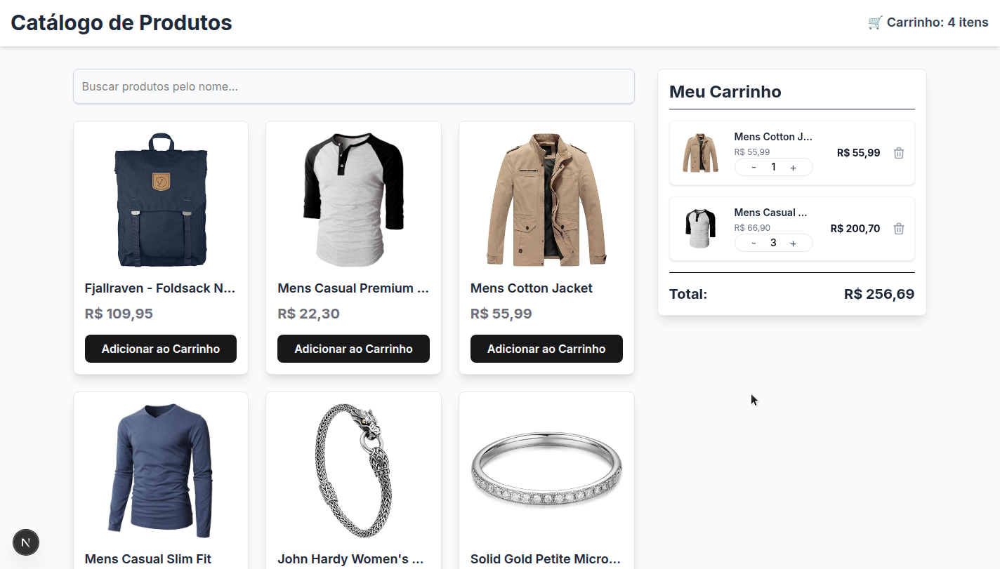

# 🛍️ Catálogo de Produtos - Desafio Full-Stack Júnior

Este projeto é uma aplicação web de um catálogo de produtos desenvolvida como parte de um desafio técnico para uma posição de Desenvolvedor Full-Stack Júnior. A aplicação permite aos utilizadores visualizar produtos de uma API, filtrá-los por nome e gerir um carrinho de compras simples.

### ✨ [Clique aqui para ver a demonstração ao vivo](https://catalogo-produtos-lilac.vercel.app/) ✨

## 📸 Screenshot



---

## ✅ Funcionalidades

- [x] **Listagem de Produtos:** Exibe produtos (imagem, nome e preço) consumidos a partir da API pública [Fake Store API](https://fakestoreapi.com/).
- [x] **Filtro por Nome:** Um campo de busca que filtra os produtos em tempo real à medida que o utilizador digita.
- [x] **Carrinho de Compras Funcional:**
    - Adicionar produtos ao carrinho. O mesmo produto adicionado múltiplas vezes tem a sua quantidade incrementada.
    - O contador no cabeçalho exibe o número total de unidades no carrinho.
    - Visualizar os itens no carrinho, com a capacidade de aumentar, diminuir ou remover itens.
    - Cálculo automático do subtotal por item e do valor total do carrinho.
- [x] **Layout Responsivo:** A interface adapta-se de forma elegante a diferentes tamanhos de ecrã, desde telemóveis a monitores de desktop (Mobile-First).

---

## 🚀 Tecnologias Utilizadas

- **Front-end:** [**Next.js 13+**](https://nextjs.org/) (com App Router)
- **Estilização:** [**Tailwind CSS**](https://tailwindcss.com/)
- **Gestão de Estado:** [**Redux Toolkit**](https://redux-toolkit.js.org/)
- **Linguagem:** [**TypeScript**](https://www.typescriptlang.org/)
- **API:** [**Fake Store API**](https://fakestoreapi.com/products)

---

## ⚙️ Como Executar o Projeto Localmente

Para clonar e executar esta aplicação localmente, vai precisar do [Git](https://git-scm.com) e do [Node.js](https://nodejs.org/en/) (que vem com o `npm`) instalados no seu computador.

A partir da sua linha de comando:

```bash
# 1. Clone o repositório
$ git clone [https://github.com/FelipeFMS08/catalogo-produtos.git](https://github.com/FelipeFMS08/catalogo-produtos.git)

# 2. Entre na pasta do projeto
$ cd catalogo-produtos

# 3. Instale as dependências
$ npm install

# 4. Execute a aplicação em modo de desenvolvimento
$ npm run dev
````

Após executar o último comando, abra [http://localhost:3000](http://localhost:3000) no seu navegador para ver a aplicação.

-----

### 1\. **Componentização**

A aplicação foi dividida em componentes pequenos e focados (`ProductCard`, `SearchBar`, `Cart`), promovendo a reutilização de código e a separação de responsabilidades.

### 2\. **Estilização com Tailwind CSS**

O TailwindCSS possibilita construir interfaces complexas e responsivas de forma rápida e consistente diretamente no JSX. A abordagem Mobile-First foi utilizada, garantindo uma boa experiência em dispositivos móveis por padrão.

### 3\. **Gestão de Estado com Redux Toolkit**

O estado do carrinho de compras é uma peça de estado global. Para gerir esta complexidade de forma previsível e escalável, foi escolhido o **Redux Toolkit (RTK)**, a ferramenta oficial para trabalhar com Redux que reduz código repetitivo e integra as melhores práticas do ecossistema.

### 4\. **Busca de Dados**

A busca inicial de produtos é feita em uma pasta separada (`services/product.service.ts`). E ja é carregada na pagina inicial (`app/page.tsx`) pois o Next.JS ja permite essa busca otimizada.

-----

## 🚀 Deploy

O deploy desta aplicação pode ser feito facilmente com a [**Vercel**](https://vercel.com/):

1.  Faça o *push* do seu código para este repositório no GitHub.
2.  Crie uma conta na Vercel e conecte-a à sua conta do GitHub.
3.  Importe o repositório `catalogo-produtos` na Vercel.
4.  A Vercel detetará automaticamente que é um projeto Next.js e fará o deploy.

-----

## 📄 Licença

Este projeto está sob a licença MIT.
